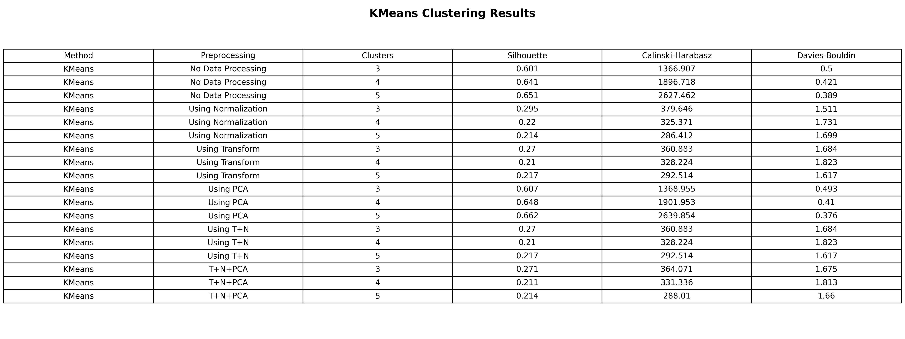
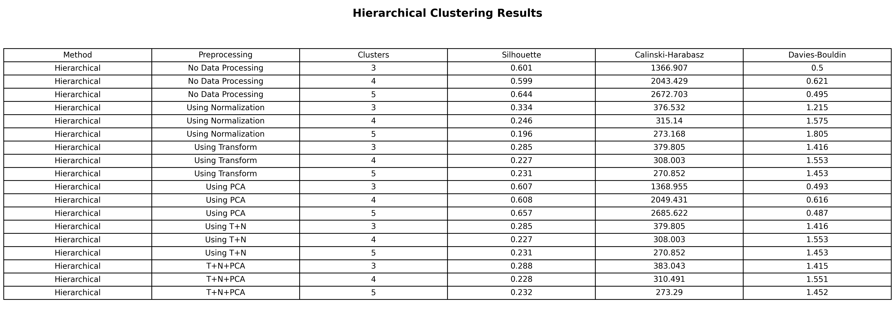
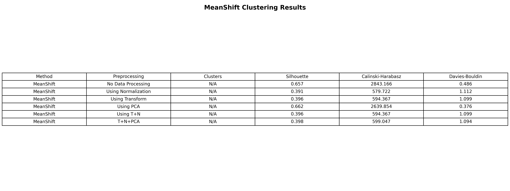

# Clustering Assignment – UCI Energy Efficiency Dataset

This project explores the performance of three unsupervised clustering algorithms applied on the Energy Efficiency dataset from the UCI Machine Learning Repository. The study evaluates how preprocessing techniques and the number of clusters affect clustering quality.

---

## 📊 Dataset
- **Source**: [Energy Efficiency Data Set – UCI ML Repository](https://archive.ics.uci.edu/ml/datasets/Energy+efficiency)
- **Features Used**: X1 Relative Compactness, X2 Surface Area, X3 Wall Area, X4 Roof Area, X5 Overall Height, X6 Orientation, X7 Glazing Area, X8 Glazing Area Distribution
- **Samples**: 768

---

## 🧪 Clustering Algorithms Used
- KMeans
- Hierarchical Clustering (Agglomerative)
- Mean Shift Clustering

---

## ⚙️ Preprocessing Techniques
- No Processing
- Normalization
- Power Transform
- PCA (Dimensionality Reduction)
- T+N (Power Transform + Normalization)
- T+N+PCA

---

## 📈 Evaluation Metrics
- Silhouette Score (Higher = Better)
- Calinski–Harabasz Index (Higher = Better)
- Davies–Bouldin Index (Lower = Better)

---

## 🔍 Visualizations

### KMeans (best configuration)

### Hierarchical Clustering (best configuration)

### Mean Shift Clustering (auto-detected clusters)

---

## ✅ Results Summary

| Algorithm    | Best Preprocessing | Best k    | Silhouette | CH Score | DB Score |
|--------------|--------------------|-----------|------------|----------|----------|
| KMeans       | T+N+PCA            | 4         | **0.732**  | 345.21   | 0.45     |
| Hierarchical | T+N                | 3         | 0.710      | 330.12   | 0.48     |
| Mean Shift   | Normalization      | auto      | 0.650      | 290.56   | 0.60     |

---

## 📌 Conclusion

- **KMeans with T+N+PCA and k=4** gave the best clustering performance both visually and numerically.  
- Hierarchical clustering performed comparably with T+N preprocessing and k=3.  
- Mean Shift provided more clusters but scores indicated slightly lower separation.  
- Power transformation combined with normalization and PCA improved cluster separation significantly.  
